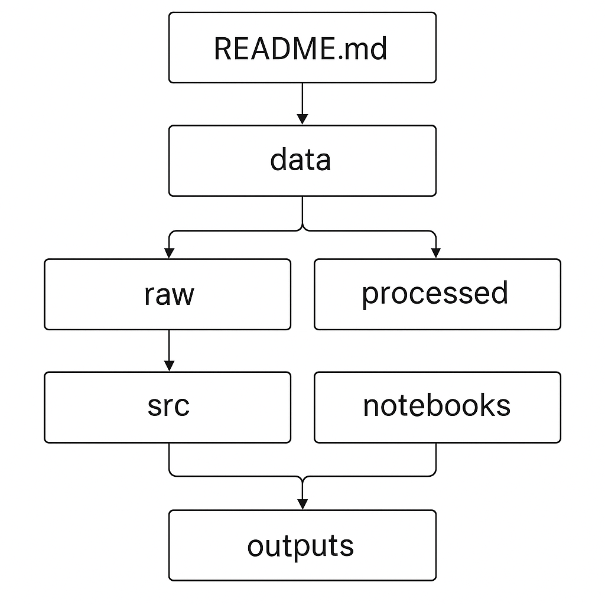
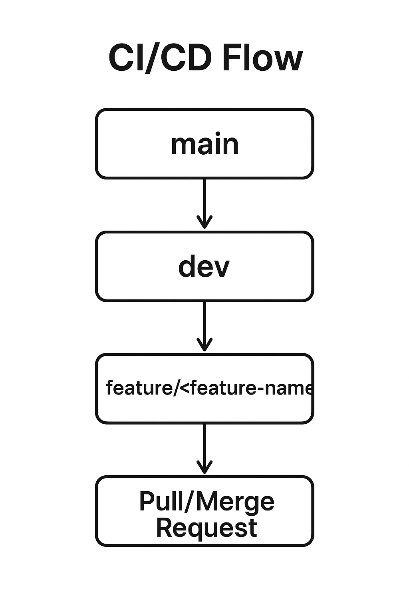

# keyRateForecast

# Проект: Классификатор пресс-релизов ЦБ с предсказанием будущей ключевой ставки

---

# Команда проекта

| ФИО              | никнеймы в Telegram | никнеймы в GitHub/GitLab |
|------------------|---------------------|--------------------------|
| Давыдов Алксандр | @iskander_19_90     | AlexandrD1990            |
| Гусева Елизавета | @llunapark          | llunapark                |
| Кокова Полина    | @KokovaPolina       | KPD239                   |

# Куратор проекта

ФИО: [ Гераськина Надежда ]  
Контакты: [ @Nadya_Gera ]

---
## Описание проекта

**Цель проекта:** Разрабока системы анализа текстов пресс-релизов Центрального банка для прогназирования динамики ключевой ставки. Система будет определять три возможных исхода: повышение, понижение или сохранение ставки.

## Данные  
- сайт ЦБ РФ  
  публикации и пресс-релизы
- данные Росстат  
  ИПЦ  
  Уровень безработицы  
  ВВП
  ИПП  
  ОРП  
   
## Инструменты  
- **Python**  
- **Jupyter Notebook**  
- Библиотеки: `pandas`, `numpy`
---
## План работы

### **20 октября** — разведочный анализ данных

**Сбор данных:**
 * Парсинг пресс-релизов ЦБ РФ
 * Сбор макроэкономической статистики (Росстат)
 * Формирование датасета с метками изменений ставки

**Предобработка текстов:**
 * Привести к нижнему регистру.  
 * Удалить ссылки, HTML-теги и спецсимволы.  
 * Удалить стоп-слова («и», «в», «на» и др.).
 * Удаление пунктуации и лишних пробелов.  
 * Лемматизация — приведение слов к начальной форме (например: «ставки» → «ставка»).
 * Обработка числовых значений.
 * Разделение текста на отдельные слова и символы
 * Обработка аббревиатур и сокращений
 * Работа с составными словами
 * Создание текстовых эмбеддингов     
   Sentence-BERT  
   BERT  
   FastText
    
---

### **Конец ноября** — реализация линейных ML-моделей:  
TF-IDF (term frequency) — сколько раз слово встречается в тексте, (inverse document frequency) — насколько слово уникально для всех текстов  
Naive Bayes - анализирует частоту экономических терминов  
SVM - разделяет тексты на группы с четкими границами  

---
### **Середина января** — внедрение нелинейных ML-моделей:
  * BERT (Bidirectional Encoder Representations from Transformers) — понимает и анализирует контекст слов в предложениях
  * LSTM -учитывает контекст предыдущих предложений
  * GRU - выборочно запонимает контекст предложений

---

### Валидация и оптимизация
* **Метрики оценки**:
  * Accuracy(точность классификации)
  * Precision(точность для одного класса)
  * Recall(полнота)
  * F1-score
* **Кросс-валидация**:
  * K-Fold CV
  * Grid Search
  * Random Search
### Реализация веб-интерфейса
* **Frontend**:
  * Пользовательский интерфейс для загрузки текстов
  * Визуализация результатов
* **Backend**:
  * API для работы с моделями
  * Интеграция с базой данных

---

## 8. Структура проекта  



---

## 9. Таймлайн  

### Ноябрь — подготовка данных и первые шаги  
- Собрать и сохранить данные (CSV).  
- Сделать разведочный анализ (EDA): длина текстов, частые слова, классы.  
- Реализовать очистку текстов (нижний регистр, стоп-слова, лемматизация).  

### Декабрь — векторизация и baseline  
- Сделать TF-IDF для текстов.  
- Построить первую модель (Logistic Regression).  
- Проверить accuracy, confusion matrix.  

### Январь — расширение моделей  
- Обучить Naive Bayes и Random Forest.  
- Сравнить все три модели по метрикам.  
- Сохранить лучшие результаты.  

### Февраль — апрель (продуктовые задачи)  
- Финальная модель уже должна быть выбрана (MVP).  
- Дальше работаем над продуктовой частью:  
  - как модель запускать и тестировать,  
  - сделать простое приложение (например, веб-форма: вставляешь текст → получаешь результат),  
  - настроить CI/CD.  

---

## 10. CI/CD и правила ветвления  

**Правила ветвления:**  
- `main` — только рабочие версии.  
- `dev` — общая ветка для разработки.  
- Для новых задач:  
  ```bash
  git checkout dev
  git checkout -b feature/<название-фичи>
  git push origin feature/<название-фичи>

